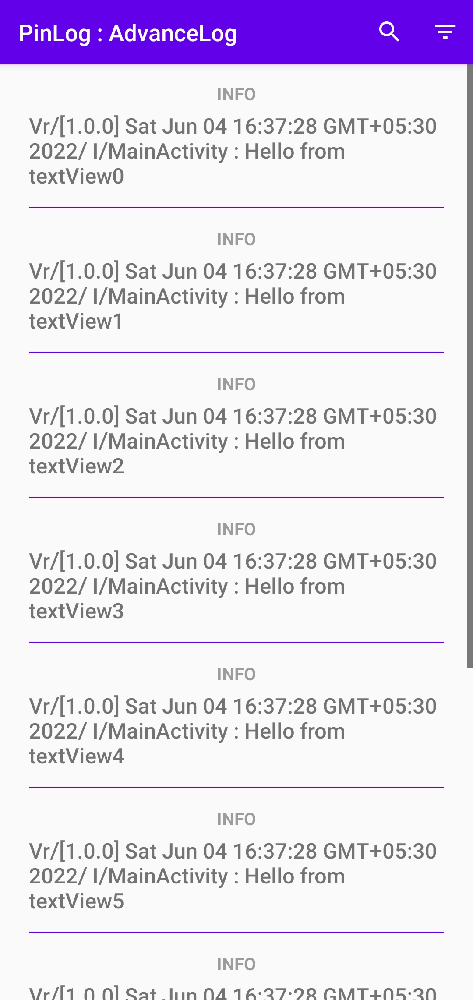

# What is PinLog?
Using PinLog, you can store your logs in a sql database and also save them in a file on android without writing hundreds of lines of code. 
```kt
//Logs are automatically stored.
PinLog.logI("MainActivity","onCreate")

//Or create a report which contains 
//PinLogs, applicationInfo, BuildConfig if was 
//provided while initialisation and System logs.
PinLog.CrashReporter().createReport(thread,exception)

//Get stored logs 
PinLog.getAllPinLogsAsStringList() 

//Delete stored logs 
PinLogs.deleteAllPinLogs()
```


PinLog-Activity is
an extension library for PinLog usefull for debuging and finding bug by isolation of logs. 


PinLog also supports Uncaught Exception Handling, which you can use like this :
```kt
PinLog.setupExceptionHandler(
toEmails = arrayOf("example@gmail.com"), 
message ="You can add additional comments 
in this email which may help us a lot.",
subject =  "Sorry MyApplication crashed, 
we will try better next time.")
```

PinLog is an easy-to-use and powerful android Logging Library. It is made by Aditya Bavadekar.


PinLog supports storing logs for later retrieval, saving logs in a file, saving logs in a zip file and more.

This project contains two modules i.e libraries namely  `pinlog` the main library and `pinlog-activity` the extension library.
The main library does not depend on the other library, so you can use it directly from dependency.

### Screenshots of `pinlog-activity` library

|||
|---|---|

# Latest version
For the latest version and a complete changelog, please see the Release page.
# Download
You can download a aar or .zip rom this repositor's releases page.

Or you can clone the whole repository with 
```bash
git clone https://github.com/AdityaBavadekar/PinLog
```

# Implementation 

### Using Gradle : 
> Add `maven{  }` in your build.gradle(project)
```gradle
allprojects {
    repositories {
      //Add this `maven` block
      maven { url 'https://jitpack.io' }
    }
}
```
> Add the dependency
 
```gradle
dependencies {
     // Refer the above badge for latest `TAG`.
    implementation 'com.github.AdityaBavadekar.PinLog:pinlog:TAG'
    //Or if you want a DebugLogsActivity for 
    //your app which shows list of logs add this instead
    debugImplementation 'com.github.AdityaBavadekar.PinLog:pinlog-activity:TAG'
    
}
```
### Using Maven : 
> Add `repository`
```xml
	<repositories>
		<repository>
		    <id>jitpack.io</id>
		    <url>https://jitpack.io</url>
		</repository>
	</repositories>
```
> Add the dependency

```xml
	<dependency>
	    <groupId>com.github.AdityaBavadekar.PinLog</groupId>
	    <artifactId>pinlog</artifactId>
	    <version>TAG</version>
	</dependency>
```

```xml
<!--Or if you want a DebugLogsActivity for 
     your app which shows list of logs add this instead-->
	<dependency>
	    <groupId>com.github.AdityaBavadekar.PinLog</groupId>
	    <artifactId>pinlog-activity</artifactId>
	    <version>TAG</version>
	</dependency>
```

# How do I use PinLog?

### Initialisation
 - PinLog should be initialised in the Application Class :
```kotlin
class App : Application() {

    override fun onCreate() {
        super.onCreate()

         PinLog.initialise(this)
         PinLog.setDevLogging(true)//Optional
         PinLog.setBuildConfigClass(BuildConfig::class.java)//Optional
    }

}
```
*OR*
```kotlin
 //For Debuggable Builds
 PinLog.initialiseDebug(this@App)

 //For Release Builds
 PinLog.initialiseRelease(this@App)
```

### Usage
```kotlin

class MainActivity : AppCompatActivity() {

    override fun onCreate(savedInstanceState: Bundle?) {
        super.onCreate(savedInstanceState)
        setContentView(R.layout.activity_main)
        logI("onCreate")
        logW("This is a warning")
        logE("This is a error")
        logD("This is a debug log")
        //OR
        PinLog.logI("MainActivity","onCreate")
        PinLog.logW("MainActivity","This is a warning")
        PinLog.logE("MainActivity","This is a error")
        PinLog.logD("MainActivity","This is a debug log")

        //Get stored logs
        PinLog.getAllPinLogsAsStringList()
        //Delete stored logs
        PinLogs.deleteAllPinLogs()

    }

}
```


You can customise the log format 
by extending [`LoggingStyle`](https://github.com/AdityaBavadekar/PinLog/blob/master/pinlog/src/main/java/com/adityaamolbavadekar/pinlog/LoggingStyle.kt) class and 
configuring it with PinLog by calling 

```kt
PinLog.setLogFormatting(myCustomLoggingStyle)
```


But the default implementation that is in 
the class called as [`DefaultApplicationLoggingStyle`](https://github.com/AdityaBavadekar/PinLog/blob/master/pinlog/src/main/java/com/adityaamolbavadekar/pinlog/DefaultApplicationLoggingStyle.kt)
Which has output similar to this line.
```
Vr/[0.0.1-debug] Mon Jul 04 14:13:44 GMT+05:30 2022/ D/AuthFragment : onPause
```

# Sample
A sample called Pinlog Sample `pinlogsample` is included in the source, which
demonstrates common and simple usage of PinLog library. 
You can find debug-apks for same app in the latest relaeses.

|[View Sample App](https://github.com/AdityaBavadekar/PinLog/blob/master/pinlogsample)|[Download Sample App](https://github.com/AdityaBavadekar/PinLog/releases/latest)|
|--|--|

# Dependencies used 
Following are dependencies that were used for `pinlog-activity` module.
- Kotlin Coroutines 
- Recyclerview

# Author
[@Aditya Bavadekar](https://github.com/AdityaBavadekar) on GitHub 

# Licence

```

   Copyright 2022 Aditya Bavadekar

   Licensed under the Apache License, Version 2.0 (the "License");
   you may not use this file except in compliance with the License.
   You may obtain a copy of the License at

       http://www.apache.org/licenses/LICENSE-2.0

   Unless required by applicable law or agreed to in writing, software
   distributed under the License is distributed on an "AS IS" BASIS,
   WITHOUT WARRANTIES OR CONDITIONS OF ANY KIND, either express or implied.
   See the License for the specific language governing permissions and
   limitations under the License.

```
