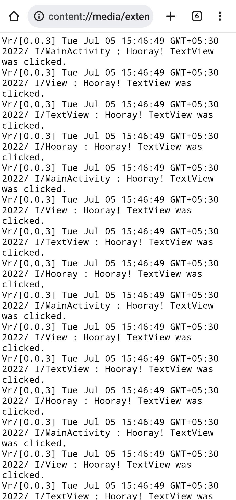

# What is PinLog Sample App?
PinLog Sample app is made to demonstrate usage of PinLog Library.

What does the app show?
- Usage of PinLogExceptionHandler.
- Usage of PinLog Logging.
- Usage of PinLog Custom Data.

If you want to see advance usage of PinLog then check out [`pinlog-activity`](https://github.com/AdityaBavadekar/PinLog/blob/master/pinlog-activity) module.

## Screenshots of *Pinlog Sample* app

|||
|---|---|
|||

